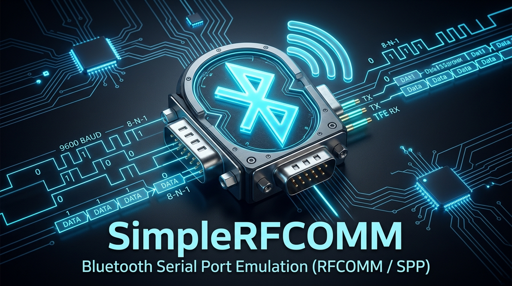

# SimpleRFCOMM

[](https://en.wikipedia.org/wiki/C%2B%2B20)
[-brightgreen.svg)]()
[]()

<p align="center">
  
</p>

**SimpleRFCOMM** is a modern, high-performance, cross-platform **C++20** library and toolset for Bluetooth RFCOMM communication with full support for **Bluetooth SDP (Service Discovery Protocol)**.

It provides a clean and expressive API for both client and server applications running on **Windows 10/11** (Winsock Bluetooth `AF_BTH`) and **Linux** (BlueZ `AF_BLUETOOTH`, including NVIDIA Jetson Orin, Raspberry Pi, and standard x86_64 distributions).

---

## Key Features

- **Near Physical Radio Channel Limit Throughput**:
  - Automatically configures oversized socket send/receive queues (`SO_SNDBUF` and `SO_RCVBUF` up to 512 KB) to prevent flow-control stalls.
  - Optimized streaming chunk size (16 KB) for maximum baseband frame packing (Bluetooth EDR 2-DH5 / 3-DH5 packets).
  - Measured hardware throughput between Windows 11 host and NVIDIA Jetson Orin: **~200 KB/s (~1.60 Mbps)**, reaching the effective payload ceiling of Bluetooth 2.1/3.0/5.x RFCOMM (~1.7–2.1 Mbps raw).
- **Full Bluetooth SDP (Service Discovery Protocol) Support**:
  - **Server**: Register any custom 128-bit UUID or standard 16-bit service profile with automatic dynamic RFCOMM channel allocation (1..30).
  - **Client**: Connect directly by UUID — the library queries the remote device's SDP database, resolves the assigned RFCOMM channel, and connects transparently.
  - **RAII Lifecycle**: SDP records are automatically unregistered when the server socket or registration guard is destroyed.
- **Modern C++20 Idiomatic API**:
  - Strongly typed `rfcomm::Address` (Bluetooth MAC BD_ADDR) with parsing, stringification, and three-way comparison (`<=>`).
  - `rfcomm::Uuid` for 128-bit and 16-bit Bluetooth UUIDs.
  - Move-only RAII `rfcomm::Socket` with `std::span` zero-copy buffers, `send_all()`, `recv_all()`, and configurable timeouts.
  - Minimalistic `rfcomm::Server` and `rfcomm::Client` classes.
  - **`rfcomm::SerialPort` FTDI style Serial com port**: An intuitive virtual serial port interface (`read()`, `write()`, `write_line()`, `read_line()`, `get_rx_queue_status()`, `purge()`, `set_timeouts()`, `set_baud_rate()`) with high-speed internal read caching.
- **Zero Heavy Dependencies**:
  - Uses native OS Bluetooth stacks (Winsock `ws2_32` on Windows, BlueZ `libbluetooth` on Linux).

---

## Documentation

- 📖 **[API Guide](API_GUIDE.md)** — Complete C++20 class and function reference, design patterns, and code recipes.
- 🛠️ **[Installation & Setup Guide](INSTALL.md)** — Step-by-step instructions for Windows 10/11 and Linux (Ubuntu / Jetson Orin / BlueZ compatibility setup).

---

## Quick Start

### 1. Server with SDP Registration

```cpp
#include <simple_rfcomm/simple_rfcomm.hpp>
#include <iostream>

int main() {
    rfcomm::Server server;
    auto service_uuid = rfcomm::Uuid::parse("e3b0c442-98fc-1c14-9afe-4c9c2e0b5f12");

    // Listen on an OS-assigned channel and publish service via SDP
    if (!server.listen_with_sdp(service_uuid, "SimpleRFCOMM Service")) {
        std::cerr << "Failed to start server and publish SDP!\n";
        return 1;
    }

    std::cout << "Listening on assigned RFCOMM channel: " << (int)server.channel() << "\n";

    // Accept incoming connection
    auto socket = server.accept();
    std::cout << "Client connected from: " << socket->peer_address().to_string() << "\n";

    // Receive data
    std::vector<uint8_t> buffer(4096);
    auto bytes_read = socket->recv(buffer);

    // Send response
    socket->send_all(std::string_view("Hello from RFCOMM Server!"));

    return 0;
}
```

### 2. Client with SDP Discovery

```cpp
#include <simple_rfcomm/simple_rfcomm.hpp>
#include <iostream>

int main() {
    rfcomm::Client client;
    auto target_mac = rfcomm::Address::parse("9C:C7:D3:F6:E6:A8");
    auto service_uuid = rfcomm::Uuid::parse("e3b0c442-98fc-1c14-9afe-4c9c2e0b5f12");

    // Automatically discover channel via SDP and connect
    auto socket = client.connect_by_sdp(target_mac, service_uuid);
    if (!socket) {
        std::cerr << "Failed to discover or connect to service!\n";
        return 1;
    }

    std::cout << "Connected to remote channel: " << (int)socket->peer_channel() << "\n";

    // Stream 16 KB data chunk
    std::vector<uint8_t> data(16 * 1024, 0x55);
    socket->send_all(data);

    return 0;
}
```

---

## Verified Hardware Benchmarks

The library has been verified with real Bluetooth hardware between a **Windows 11 host** (Intel Wireless Bluetooth, BD_ADDR `8C:E9:EE:81:55:F5`) and an **NVIDIA Jetson Orin** (Realtek Bluetooth 5.1, BD_ADDR `9C:C7:D3:F6:E6:A8` at IP `192.168.8.66`):

### 1. Throughput Benchmark (2 MB Data Stream with SDP Discovery)

| Direction | Payload | Duration | Speed (KB/s) | Speed (Mbps) | SDP Resolution |
| :--- | :--- | :--- | :--- | :--- | :--- |
| **Windows -> Jetson Orin** | 2.0 MB (2,097,152 B) | 10.27 s | **199.39 KB/s** | **~1.60 Mbps** | 985 ms |
| **Jetson Orin -> Windows** | 2.0 MB (2,097,152 B) | 14.48 s | **141.40 KB/s** | **~1.13 Mbps** | 3726 ms |

> **Note on Performance**: Classical Bluetooth 2.1+EDR physical rate is 3 Mbps (8DPSK). Accounting for baseband framing, packet acknowledgement, L2CAP segmentation, and RFCOMM credit-based flow control, the maximum real-world payload throughput is ~180–240 KB/s. The measured **~200 KB/s** operates at the physical limit of the RF channel.

### 2. Round-Trip Latency (Echo Mode)
- 512 KB payload in 4 KB chunks with round-trip acknowledgement:
- **Average RTT**: **61.18 ms** per 4 KB chunk.

---

## Building and Running

### Build on Windows (Visual Studio / MSVC)
```powershell
cmake -B build -G "Visual Studio 17 2022" -A x64
cmake --build build --config Release
```

### Build on Linux (Jetson Orin / Ubuntu)
```bash
sudo apt update && sudo apt install -y build-essential cmake libbluetooth-dev

mkdir -p build && cd build
cmake -DCMAKE_BUILD_TYPE=Release ..
make -j$(nproc)
```

### Running Benchmark Examples

**On Server Machine (e.g. Jetson Orin):**
```bash
./build/server_bench
```

**On Client Machine (e.g. Windows Host):**
```powershell
.\build\Release\client_bench.exe 9C:C7:D3:F6:E6:A8 --size 2.0 --chunk 16
```

**Interactive Two-Way Terminal Chat:**
```bash
# Machine A (Server):
chat_echo server "My Chat Service"

# Machine B (Client):
chat_echo client <MAC_OF_MACHINE_A>
```

---

## License

MIT License. Free for commercial and open-source use.
